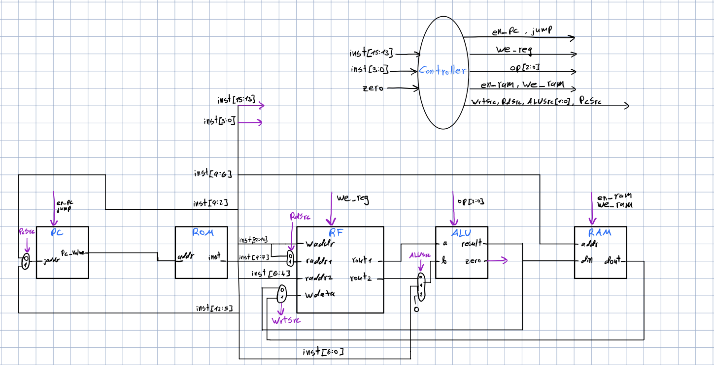

# mini-CPU

This project implements a simple **8-bit CPU** in Verilog, designed as an educational processor that demonstrates the basic concepts of CPU architecture: instruction fetch, decode, execute, memory access, and write-back.

## 🧩 Components

- **ALU** – supports arithmetic and logic operations (ADD, SUB, AND, OR, XOR, with carry/overflow flags).
- **Register File (8×8)** – 8 general-purpose registers, 8 bits wide, supporting 2 reads and 1 write per cycle.
- **Data RAM (16×8)** – 16 addresses, 8 bits wide, supports synchronous write and read.
- **Program Counter (PC)** – 8-bit counter with reset, enable, and jump support.
- **Instruction ROM (256×16)** – stores the program instructions, loaded from a memory file (`program.mem`).
- **Controller (FSM/Decoder)** – decodes instructions (R/I-type, Load/Store, Jump, Branch) and generates control signals.

## 📝 Instruction Set Architecture (ISA)

- **R-type**: register–register operations (ADD, SUB, AND, OR, XOR, …).
- **I-type**: register–immediate operations (currently ADDI, expandable to ANDI/ORI/XORI/SLLI).
- **Load/Store**: access 16×8 data RAM.
- **Jump**: unconditional jump to 8-bit address.
- **Branch**: minimal branch support (e.g., BEQZ/BNEZ).

All instructions are 16 bits wide and follow a fixed format.

## ⚙️ Simulation

1. Compile:
   ```bash
   iverilog -o cpu_tb.out alu.v ram.v regfile.v pc.v instr_rom.v controller.v cpu_tb.v

## 🖼️ Architecture




